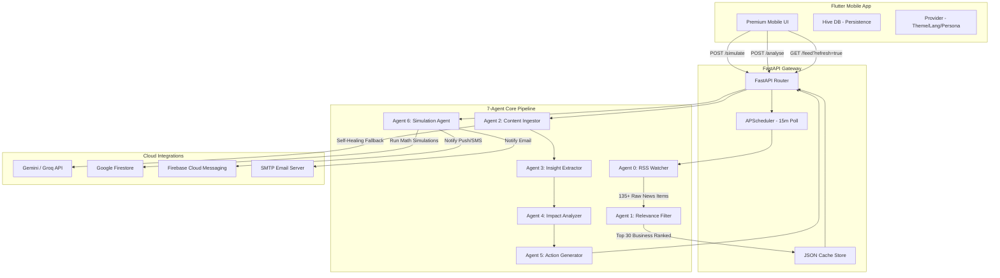

# 🌌 TadbeerAI: Proactive Business Intelligence System

TadbeerAI is a premium, enterprise-grade **Active AI-Decision Support System** tailored specifically for Pakistani business owners and financial operators. It monitors the highly volatile Pakistani macroeconomic landscape—analyzing real-time shifts in energy prices, rupee fluctuations, stock market (KSE-100) indices, gold bullion rates, and trade policies—and automatically generates actionable business strategies, executes operational simulations, tracks state changes, and alerts key stakeholders.

This repository contains both the **FastAPI Multi-Agent Backend** (Python) and the **Premium Flutter Mobile Application** (Dart), forming a cohesive, end-to-end, self-healing intelligence ecosystem.

---

## 🏗️ System Architecture

TadbeerAI is built on a highly decoupled, service-oriented architecture:



---

## 🤖 The 7-Agent Network

The core value of TadbeerAI lies in its specialized, collaborative **Multi-Agent Network**:

| Agent | Module | Description | Key Tech |
| :--- | :--- | :--- | :--- |
| **Agent 0** | **RSS Watcher** | Periodically polls 6 major Pakistan financial RSS feeds (Dawn, Business Recorder, ARY News, etc.). Deduplicates entries by URL hash. | `feedparser`, `httpx` |
| **Agent 1** | **Relevance Filter** | Filter sports/lifestyle news and scores articles for strict Pakistani business relevance. Maps news to 1 of 9 operational domains. | `relevance_filter.py` |
| **Agent 2** | **Content Ingestor** | Scrapes full articles. Employs a **Self-Healing LLM Fallback** to reconstruct realistic article bodies if a site blocks bots with 403 or requires JS. | `BeautifulSoup`, `call_llm` |
| **Agent 3** | **Insight Extractor** | Extracts specific business signals from text, quantifying SBP rate changes, PKR devaluation, and fuel hikes without hallucinations. | `Gemini 2.0 Flash` |
| **Agent 4** | **Impact Analyzer** | Assesses business SWOT impacts across key metrics (delivery fees, customer churn, supply chain delays, alternate sourcing). | `Groq / Llama 3.3` |
| **Agent 5** | **Action Generator** | Generates ranked, highly practical operational decisions. Quantifies churn risk, timeline, and business mathematics. | `action_generator.py` |
| **Agent 6** | **Simulation Agent** | Executes selected actions, performs real-world math simulations, updates variables in the mock/real DB, and triggers FCM/SMS/Email alerts. | `simulation_agent.py` |

---

## 🏗️ Key Engineering Features

### 🔌 1. Self-Healing Crawler System
Many Pakistani news portals implement aggressive security measures (like Cloudflare walls) that block automated headers with HTTP 403, or utilize dynamic SPA frameworks that return blank HTML. 

Instead of showing a raw HTTP 422 error, **Agent 2 automatically self-heals**:
* It parses the URL slug and domain (e.g. `kse-100-rises-715-points-as-buying-activity-picks-up-across-key-sectors`).
* It invokes the active LLM (Gemini or Groq) to generate a realistic, 150-250 word financial news article representing exactly what the article is about.
* The downstream agents analyze this generated text seamlessly, ensuring the user experiences a flawless analysis flow with zero crashes!

### 👤 2. Dynamic Category-Wise Personalization (Personas)
TadbeerAI is built around **4 specialized user personas**: **Shop Owners, Business Owners, Salaried Employees, and Students**. Personalization happens at every stage of the pipeline:
* **Backend Keyword Filtering:** The `/feed` endpoint filters the news feed by keyword dictionaries specific to each persona, ensuring users only see what is relevant to their role.
* **Frontend Relevance Scoring & Badging:** The Flutter app runs a dynamic scoring algorithm to sort highly relevant news cards to the top of the feed, complete with visual UI badges (`Shop Specific`, `Student Specific`, etc.).
* **Persona-Driven Agent Reasoning:** The downstream AI agents (Agents 3, 4, and 5) receive the user's profile and dynamically tailor their extracted insights, SWOT impacts, and recommended operational decisions to fit the user's specific context.

### 📢 3. Multi-Channel Alert Delivery System
When a user decides to execute a recommended action:
* **Execution Engine:** Clicking "Execute & notify users" invokes Agent 6, running mathematical state changes on the server and persisting changes to Firestore (or JSON database fallback).
* **SMTP & FCM Integration:** Dispatches real push notifications via Firebase Cloud Messaging and professional risk reports via SMTP Email to registered account users.
* **Gemini-Powered SMS Drafting:** Automatically calls Gemini to draft a contextually relevant, customer-facing SMS announcement explaining the operational changes (e.g., price updates or delivery delays) that the business owner can copy and send to their client lists.

### ⚡ 4. Intelligent Auto & Force-Refresh
* **Auto-Expiration:** Backend `/feed` cache automatically expires and updates if the file is more than 10 minutes old, eliminating stale news feeds.
* **Client-Side Trigger:** Pull-to-refresh and the refresh button on the Flutter app automatically pass `/feed?refresh=true`, bypassing backend caches and updating RSS feeds in real-time.

### 🎨 5. Premium Flutter UI & UX
* **Micro-Animations:** Seamless transitions, card entries, shimmers, and status changes powered by `flutter_animate`.
* **Zero Flashes:** Hive persistence is queried synchronously inside Flutter's `main()` before rendering, ensuring the user's preferred theme and language are applied immediately without transient flashes.
* **Detailed Trace Logs:** Shows full step-by-step reasoning logs (Execution Logs, State Diffs, Timings) for all past simulation alerts.

---

## 🌐 API Specifications

| Method | Endpoint | Request Body | Description |
| :--- | :--- | :--- | :--- |
| **GET** | `/health` | *None* | Health status, primary AI provider, Firestore state, and registered user count. |
| **GET** | `/feed` | `?refresh=true` (Optional) | Fetches ranked and filtered Pakistani business news (up to 30 items). |
| **POST** | `/analyse` | `{"text": "...", "source_url": "...", "language": "en"}` | Pipeline for Agent 2 → Agent 5. Returns insight, impacts, and ranked actions. |
| **POST** | `/simulate`| `{"action_index": 0, "user_id": "...", "notify_channels": []}`| Agent 6 execution. Runs simulation math, registers state diffs, and sends alerts. |
| **GET** | `/trace` | *None* | Exposes the complete 7-Agent execution log for debugging and audit transparency. |

---

## 🚀 Setup & Execution Guide

### 🐍 Backend (FastAPI) Setup

1. **Navigate to backend and configure environment:**
   ```bash
   cd tadbeerai_backend
   python -m venv .venv
   .venv\Scripts\activate   # Windows
   source .venv/bin/activate # Unix/macOS
   pip install -r requirements.txt
   ```

2. **Create `.env` file:**
   ```ini
   AI_PROVIDER=gemini # gemini | groq
   GEMINI_API_KEY=your_gemini_api_key_here
   GEMINI_MODEL=gemini-2.0-flash
   GROQ_API_KEY=your_groq_api_key_here
   GROQ_MODEL=llama-3.3-70b-versatile
   POLL_INTERVAL_MINUTES=15
   PORT=8000
   ```

3. **Start local development server:**
   ```bash
   uvicorn main:app --reload --port 8000
   ```
   Explore Swagger UI documentation at `http://127.0.0.1:8000/docs`.

---

### 📱 Frontend (Flutter) Setup

1. **Navigate to app directory and install dependencies:**
   ```bash
   cd tadbeerai_app
   flutter pub get
   ```

2. **Configure API base URL:**
   Open [api_service.dart](tadbeerai_app/lib/core/services/api_service.dart) and configure your `_base` IP or Render deployment domain:
   ```dart
   static const _base = "http://10.0.2.2:8000"; // Android Emulator PC Localhost
   ```

3. **Run Mobile App:**
   ```bash
   flutter run
   ```

---

## 🏆 Hackathon Context
* **Project Name:** TadbeerAI
* **Team Name:** TADBEERAI
* **Hackathon:** Google Antigravity AISeekho2026
* **Challenge:** 1 Autonomous Content-to-Action Agent (Insight → Action System)

---
Developed with ♥ by team **TADBEERAI**. Empowering Pakistani businesses through proactive, self-healing agentic intelligence.
