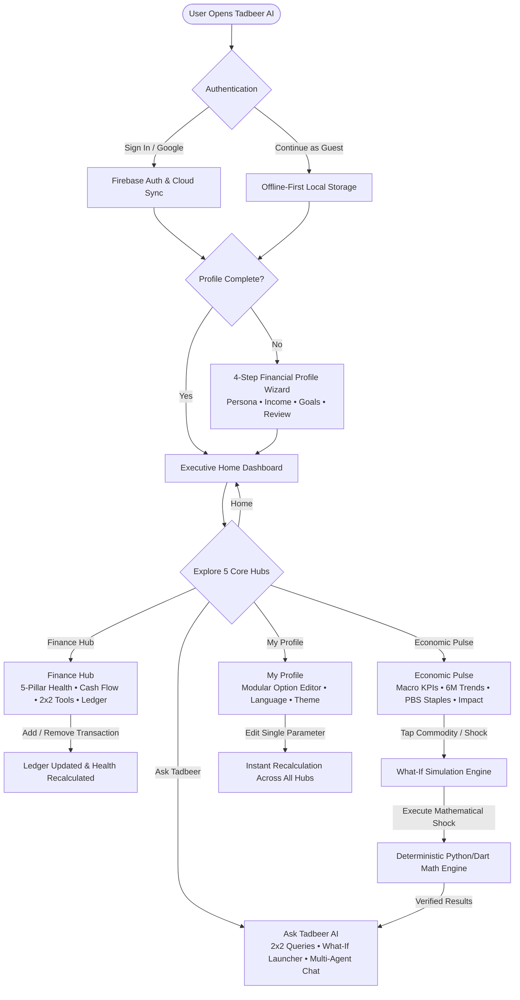
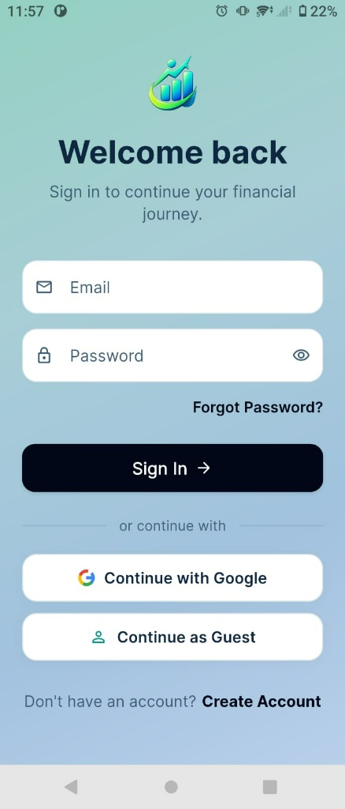
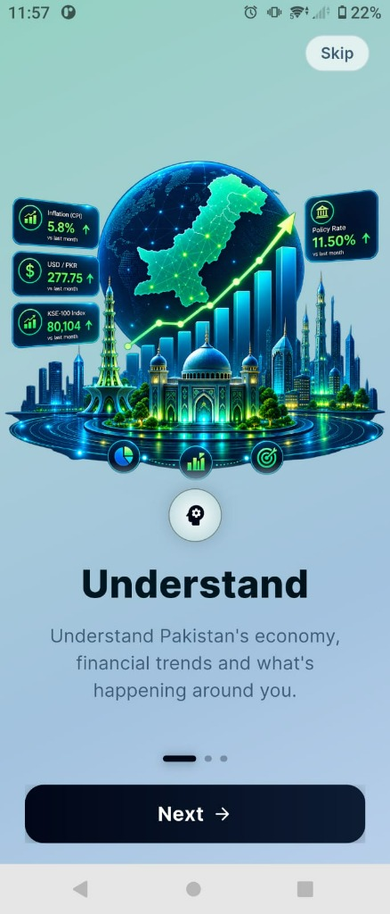
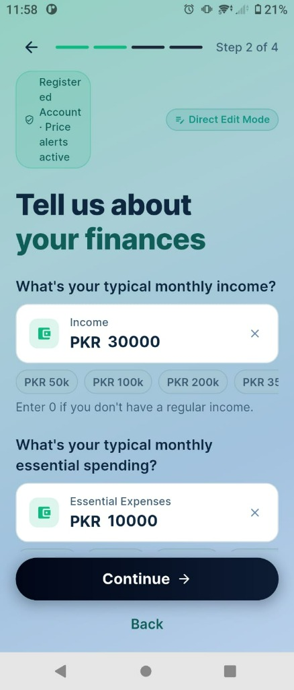
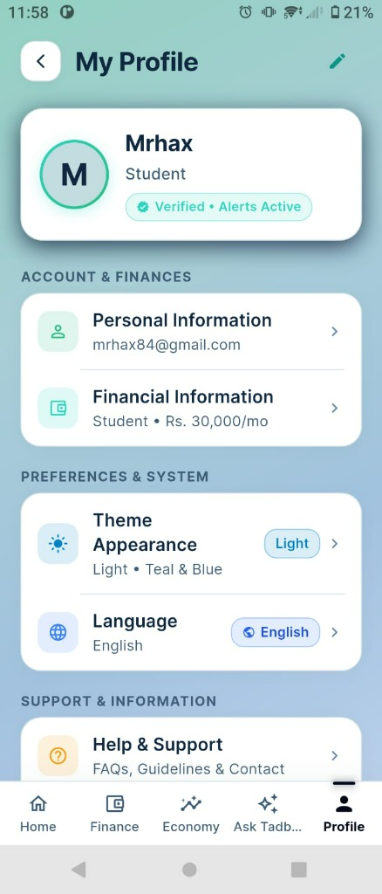
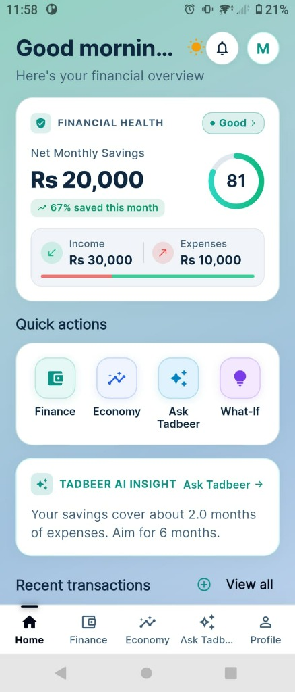
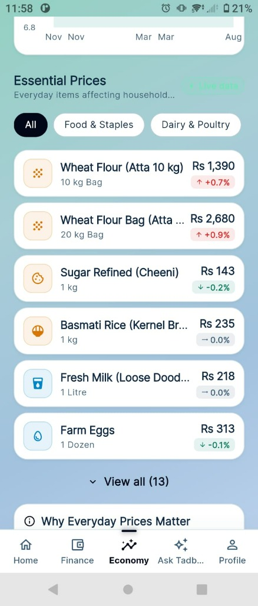
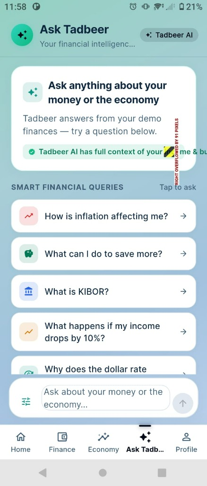
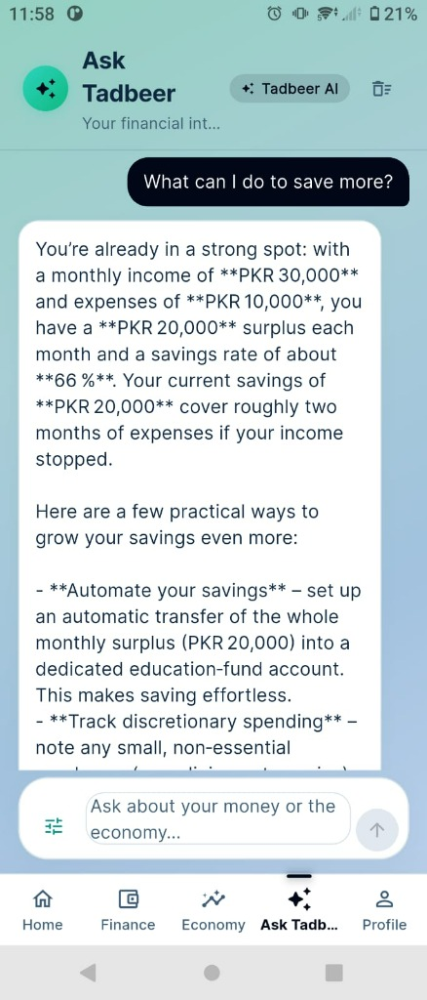

<p align="center">
  
</p>

<p align="center">
  <strong>Smarter Decisions, Brighter Tomorrows — Built for a Stronger, Financially Inclusive Pakistan 🇵🇰</strong>
</p>

<p align="center">
  <a href="#-system-architecture"></a>
  <a href="#-flutter-mobile-application"></a>
  <a href="#-fastapi-backend"></a>
  <a href="#-firebase-authentication"></a>
  <a href="#-theme--problem-definition-financial-inclusion"></a>
  <a href="#-automated-test-suite--verification"></a>
  <a href="#-code-quality"></a>
</p>

---

## 📖 Table of Contents
- [Theme & Problem Definition: Financial Inclusion](#-theme--problem-definition-financial-inclusion)
  - [The Problem in Pakistan](#the-problem-in-pakistan)
  - [Our Mission: Democratizing Financial Intelligence](#our-mission-democratizing-financial-intelligence)
- [Team Tadbeer AI](#-team-tadbeer-ai)
- [Core Application Features](#-core-application-features)
  - [1. Executive Home Command Center](#1-executive-home-command-center)
  - [2. Modernized Finance Hub & Single-Source Ledger](#2-modernized-finance-hub--single-source-ledger)
  - [3. Economic Pulse & Essential Commodities Tracker](#3-economic-pulse--essential-commodities-tracker)
  - [4. Ask Tadbeer — Multi-Agent AI Companion](#4-ask-tadbeer--multi-agent-ai-companion)
  - [5. Deterministic What-If Simulation Engine](#5-deterministic-what-if-simulation-engine)
  - [6. Modular Profile Wizard & Granular Option Editing](#6-modular-profile-wizard--granular-option-editing)
  - [7. Firebase Authentication & Offline-First Privacy](#7-firebase-authentication--offline-first-privacy)
  - [8. Native Trilingual Localization](#8-native-trilingual-localization)
- [Application Flow & Architecture](#-application-flow--architecture)
  - [End-to-End User Journey Workflow](#end-to-end-user-journey-workflow)
  - [Technical System Architecture](#technical-system-architecture)
- [Screenshots Showcase](#-screenshots-showcase)
- [Repository Structure](#-repository-structure)
- [Getting Started](#-getting-started)
  - [Backend Setup (FastAPI + LangGraph)](#backend-setup-fastapi--langgraph)
  - [Mobile App Setup (Flutter)](#mobile-app-setup-flutter)
- [Automated Test Suite & Verification](#-automated-test-suite--verification)
- [Data Sources & Provenance Transparency](#-data-sources--provenance-transparency)
- [Hackathon Milestone](#-hackathon-milestone)

---

## 🌍 Theme & Problem Definition: Financial Inclusion

### The Problem in Pakistan
In Pakistan, macroeconomic volatility directly dictates daily survival. Headline inflation surges, energy tariff revisions, fuel shocks, and currency devaluations heavily strain household budgets. Yet, the vast majority of the population remains systematically excluded from actionable financial guidance:

1. **The Advisory Gap & Elite Bias**: Professional wealth advisors and financial planning services cater exclusively to high-net-worth individuals. Over **70% of Pakistani adults are unbanked or underbanked**, leaving everyday citizens without personalized counsel.
2. **The Macro-Micro Disconnect**: While official institutions publish macroeconomic statistics (World Bank indicators, SBP policy rates, and Pakistan Bureau of Statistics SPI bulletins), these numbers are delivered as sterile percentages. Citizens cannot translate a *"+0.8% weekly SPI increase"* into *what it actually costs their specific household in flour, eggs, and fuel*.
3. **The Jargon & Language Barrier**: Most financial literature and FinTech tools are presented in dense English terminology. Everyday earners, shopkeepers, students, and informal sector workers need conversational, culturally resonant advice in **Urdu (اردو)** and **Roman Urdu**.
4. **Calculative Distrust & Hallucination Hazards**: Generic consumer AI chatbots frequently hallucinate numbers, miscalculate debt servicing ratios, and invent fictitious rates. Financial guidance demands **100% mathematical integrity**.

### Our Mission: Democratizing Financial Intelligence
**Tadbeer AI 2.0** was built from the ground up to solve these structural barriers under the theme of **Financial Inclusion**:
- **Accessibility for Everyone**: Tailored personas for **Salaried Professionals**, **Students & Learners**, **Business Owners**, and **Retail Shopkeepers**.
- **Contextualized Local Economics**: Translating real Pakistan Bureau of Statistics (PBS) commodity changes directly into family budget runway impacts.
- **Zero Mathematical Hallucinations**: All calculations (What-If shocks, savings runway, debt load, 50/30/20 budget allocations) are strictly computed by **deterministic math engines in Python and Dart**. The AI model explains, contextualizes, and advises—it never calculates.
- **Inclusive Trilingual Interface**: Seamless switching between English, Nastaliq Urdu (اردو), and accessible Roman Urdu.
- **Offline-First Resilience**: Designed for real-world connectivity constraints with local persistence on device and automatic cloud sync when connected.

---

## 👥 Team Tadbeer AI

Developed with passion for the **Alibaba Cloud AI Hackathon Pakistan 2026**:

| Team Member | Role & Core Responsibilities |
| :--- | :--- |
| **Muhammad Hashim** | **Team Lead & Full-Stack Architect**<br/>• Mobile architecture (Flutter & Riverpod) & UI/UX design systems<br/>• Multi-agent pipeline integration & deterministic math engines<br/>• End-to-end performance optimization & testing |
| **Rao Abdullah** | **AI & Backend Systems Engineer**<br/>• LangGraph multi-agent orchestration & supervisor routing logic<br/>• FastAPI gateway architecture, async microservices & Dockerization<br/>• LLM adapter reliability & fallback strategies |
| **Amir Ali** | **Data Engineering & Macro Integration**<br/>• World Bank indicators API & PBS Sensitive Price Indicator (SPI) pipelines<br/>• Macroeconomic data modeling, provenance tracking & status badges<br/>• Scenario simulation parameter calibration |
| **Khet Meshwari** | **FinTech Domain & Financial Inclusion Lead**<br/>• 5-Pillar Financial Health Index & 50/30/20 localized budgeting rules<br/>• Persona logic (Salaried, Student, Business Owner, Retailer)<br/>• Trilingual localization (English, Urdu, Roman Urdu) & user validation |

---

## 🚀 Core Application Features

### 1. Executive Home Command Center
- **Single-Screen Overview**: An uncluttered, executive dashboard displaying the user's **Financial Health Gauge (0–100)**, Net Monthly Cash Flow, and AI-driven Smart Insights.
- **Budget Pace Tracking**: Real-time progress bars monitoring the current month's spending pace against baseline essential expenses.
- **Goal Progress**: Visual tracking for active savings milestones (e.g., Emergency Fund, Education, Hajj/Umrah, Business Growth).
- **Zero Redundancy**: Focused strictly on high-level decision intelligence, eliminating clutter.

### 2. Modernized Finance Hub & Single-Source Ledger
- **5-Pillar Health Scorecard**: A transparent breakdown analyzing **Savings Sufficiency**, **Spending Discipline**, **Emergency Buffer**, **Debt Management**, and **Planning Resilience**.
- **Cash Flow Analysis**: Transparent monthly Inflow vs. Outflow with Net Surplus calculations.
- **2x2 Modular Finance Tools**: Fast access to **Expenses**, **Budget Planner (50/30/20 Rule)**, **Goals Tracker**, and **Accounts**.
- **Single Source of Truth Activity Ledger**: Instant transaction logging (Income / Expense), category attribution, and deletion with automatic rollback to profile balances.

### 3. Economic Pulse & Essential Commodities Tracker
- **Terminal-Grade Macro KPI Matrix**: High-density 2x2 matrix showcasing headline indicators (**CPI Inflation**, **USD/PKR Exchange Rate**, **SBP Policy Rate**, and **Foreign Exchange Reserves**) with explicit provenance badges (`live`, `partial`, `demo`).
- **Unified Interactive Trend Explorer**: A single, dynamic 6-month chart that lets users toggle between indicators via sleek horizontal pills—no redundant stacked charts.
- **PBS Essential Prices (Sensitive Price Indicator)**: Tracks 16+ everyday kitchen and household staples (Wheat Flour 10kg/20kg, Farm Eggs, Chicken, Beef, Mutton, Petrol Super, High-Speed Diesel, Cooking Oil, LPG).
- **Household Budget Impact Card**: Explains *"Why Everyday Prices Matter"*, with direct deep links to Ask Tadbeer and What-If scenario simulations.
- **Personalized Macro Impact**: Computes how the latest inflation surges impact *this specific user's* monthly surplus based on their chosen persona.

### 4. Ask Tadbeer — Multi-Agent AI Companion
- **Modernized Chat Interface**: Airy hero greeting, glowing AI emblem, 2x2 interactive quick-query cards (*Inflation Shock*, *Savings Plan*, *KIBOR & Rates*, *What-If Simulation*), horizontal topic chips, and a floating dock.
- **Supervised LangGraph Multi-Agent Architecture**:
  - `supervisor`: Intelligently analyzes user intent and dispatches tasks to specialist nodes.
  - `economic_intelligence`: Ingests official macro trends and PBS commodity references.
  - `personal_finance`: Evaluates the user's specific budget, income, expenses, and goals.
  - `financial_literacy`: Explains complex financial topics in plain, accessible language.
  - `risk_impact`: Synthesizes vulnerability exposure and recommends protective steps.
  - `deterministic_tools`: Executes mathematical scenario calculations outside the LLM context.
  - `response`: Composes clear, empathetic, and strictly factual recommendations.

### 5. Deterministic What-If Simulation Engine
- **Scenario Stress-Testing**:
  - *Essential Commodity Shocks*: What happens if grocery expenses surge by 10% or Rs 5,000?
  - *Fuel & Transport Hikes*: Impact of petrol/diesel tariff hikes on monthly commuting costs.
  - *Income Volatility*: Stress-testing runway against salary delays or business margin contractions.
  - *Utility Tariff Adjustments*: Electricity and gas surcharge absorptions.
- **Clear Outputs**: Delivers updated runway months, net cash flow balance, and prioritized tactical recommendations.

### 6. Modular Profile Wizard & Granular Option Editing
- **4-Step Setup Wizard**: Guides the user through Persona selection, Income & Baseline Expenses, Goal setting, and Review.
- **Individual Option Editing**: Users can edit **any single financial parameter independently** (Income, Expenses, Persona, or Goals) from their profile without having to re-run the entire wizard.

### 7. Firebase Authentication & Offline-First Privacy
- **Flexible Sign-In**: Email & Password authentication, Google Sign-In, and an instant **Continue as Guest** mode.
- **Device-First Privacy**: Guest sessions store all data in encrypted local storage (`SharedPreferences`) without sending data across the network.
- **Cloud Sync for Registered Users**: Automatically synchronizes local transactions and budgets to Firestore via `/v1/finance`.

### 8. Native Trilingual Localization
- Complete native support across all interfaces, charts, indicators, and AI dialogues:
  - 🇬🇧 **English** (`en`)
  - 🇵🇰 **Urdu** (`ur`) — باقاعدہ نستعلیق اردو میں مکمل مالیاتی رہنمائی
  - 🇵🇰 **Roman Urdu** (`ur-Latn`) — Aasan Roman Urdu for maximum informal accessibility.

---

## 🏗️ Application Flow & Architecture

### End-to-End User Journey Workflow



---

### Technical System Architecture

```mermaid
graph TB
    subgraph Client ["Flutter Mobile Client (tadbeerai_app)"]
        UI["5-Area Shell UI<br/>(Home | Finance | Economy | Ask Tadbeer | Profile)"]
        State["Riverpod State Management (Providers & Notifiers)"]
        Router["GoRouter Deep Linking & Screen Transitions"]
        Storage["Offline-First Local Cache<br/>(SharedPreferences: Profile, Budgets, Ledger)"]
        AuthRepo["AuthRepository<br/>(Firebase Auth + Guest Mock Fallback)"]
    end

    Client -->|REST & JSON (Dio with Token Auth)| Gateway

    subgraph Backend ["FastAPI AI Backend (tadbeerai_backend)"]
        Gateway["FastAPI API Gateway (/v1)"]
        FinStore["Firestore Finance Ledger<br/>(per-UID via /v1/finance, Local Fallback)"]

        subgraph DataAdapters ["Data Adapters & Gateways"]
            WB["World Bank Client<br/>(Live Annual: CPI, USD/PKR, FX, Remittances, GDP)"]
            PBS["PBS SPI Commodity Gateway<br/>(16 Essential Staple Commodities)"]
            SBP["SBP Macro Gateway<br/>(Policy Rate, KIBOR)"]
            Cache["In-Memory TTL Cache Engine"]
        end

        subgraph Engine ["Deterministic Calculation Engine (Zero Hallucination)"]
            WhatIfCalc["Scenario Calculators<br/>(Inflation, Income, Fuel, Tariffs)"]
            HealthCalc["5-Pillar Health Score & Runway Engine"]
            BudgetCalc["50/30/20 Budgeting Rule Evaluator"]
        end

        subgraph MultiAgent ["LangGraph Multi-Agent Pipeline"]
            Supervisor["supervisor (Stateful Router)"]
            NodeEcon["economic_intelligence agent"]
            NodeFinance["personal_finance agent"]
            NodeLit["financial_literacy agent"]
            NodeRisk["risk_impact agent"]
            Tools["deterministic_tools agent<br/>(Direct access to Math Engine)"]
            Composer["response composer (Verified Output)"]
        end
    end

    Gateway --> DataAdapters
    Gateway --> Engine
    Gateway --> FinStore
    Gateway --> MultiAgent
    DataAdapters --> Cache
    Storage -.->|Online Cloud Sync| FinStore

    Supervisor --> NodeEcon
    Supervisor --> NodeFinance
    Supervisor --> NodeLit
    Supervisor --> NodeRisk
    Supervisor --> Tools

    NodeEcon --> DataAdapters
    NodeEcon --> Tools
    NodeFinance --> Tools
    Tools --> Engine
    NodeRisk --> Composer
    Tools --> Composer
```

---

## 📱 Screenshots Showcase

### Onboarding, Authentication & Profile Setup

<table>
  <tr>
    <td align="center" width="25%">
      <br/>
      <sub><b>Welcome Back</b><br/>Email, Google &amp; Guest sign-in</sub>
    </td>
    <td align="center" width="25%">
      <br/>
      <sub><b>Understand</b><br/>Localized macroeconomic context</sub>
    </td>
    <td align="center" width="25%">
      <br/>
      <sub><b>Step 2: Finances</b><br/>Monthly income &amp; essential spend</sub>
    </td>
    <td align="center" width="25%">
      <br/>
      <sub><b>My Profile</b><br/>Modular financial editing &amp; theme</sub>
    </td>
  </tr>
</table>

### Core Hubs & AI Experience

<table>
  <tr>
    <td align="center" width="25%">
      <br/>
      <sub><b>Home Dashboard</b><br/>Executive health gauge &amp; pace</sub>
    </td>
    <td align="center" width="25%">
      <br/>
      <sub><b>Finance Hub</b><br/>5 pillars, cash flow &amp; ledger</sub>
    </td>
    <td align="center" width="25%">
      <br/>
      <sub><b>Economic Pulse</b><br/>PBS SPI prices &amp; trend charts</sub>
    </td>
    <td align="center" width="25%">
      <br/>
      <sub><b>Ask Tadbeer AI</b><br/>Multi-agent chat &amp; What-If tool</sub>
    </td>
  </tr>
</table>

---

## 📂 Repository Structure

```
TadbeerAI 2.0/
├── assets/
│   ├── banner.png                   # Official Tadbeer AI 2.0 Banner
│   └── screenshots/                 # Application screenshots showcase
│
├── tadbeerai_app/                   # Flutter Cross-Platform Client
│   ├── lib/
│   │   ├── core/                    # Theme tokens, router, formatters, shared widgets
│   │   ├── data/                    # Repositories (API, Mock, Firebase Auth)
│   │   ├── domain/                  # Entities (CommodityPrice, EconomicIndicator, Profile)
│   │   ├── features/
│   │   │   ├── assistant/           # Modernized Ask Tadbeer chat, prompts & floating dock
│   │   │   ├── auth/                # Login, Signup, AuthController & Guest session
│   │   │   ├── dashboard/           # Cleaned Home command center (no duplicated feeds)
│   │   │   ├── economy/             # Macro KPI matrix, interactive trends, PBS staples
│   │   │   ├── finance/             # 5-Pillar health index, cash flow, activity ledger
│   │   │   └── profile/             # Profile wizard & granular individual option editors
│   │   ├── l10n/                    # Native ARB catalogs (en, ur, ur-Latn)
│   │   └── providers/               # Riverpod state notifiers and service injection
│   └── test/                        # 334 Unit, Repository, Widget & Integration tests
│
└── tadbeerai_backend/               # Python FastAPI + LangGraph Backend
    ├── core/
    │   ├── agents/                  # LangGraph multi-agent graph, supervisor & specialist nodes
    │   ├── economic_data/           # World Bank annual client + PBS SPI commodity gateway
    │   ├── llm/                     # Multi-provider LLM adapters (Gemini, Groq, Mock)
    │   ├── scenarios/               # Deterministic mathematical What-If calculators
    │   └── api_v1.py                # REST endpoints (/v1/assistant/chat, /v1/economy, /v1/finance)
    ├── main.py                      # FastAPI server entrypoint
    └── tests/                       # 320 Pytest backend tests
```

---

## ⚡ Getting Started

### Prerequisites
- **Flutter SDK**: 3.22.0 or higher
- **Python**: 3.11 or higher
- **Git**

---

### Backend Setup (FastAPI + LangGraph)

1. **Navigate to the backend directory**:
   ```bash
   cd tadbeerai_backend
   ```

2. **Create and activate a virtual environment**:
   ```bash
   # Windows (PowerShell)
   python -m venv .venv
   .\.venv\Scripts\Activate.ps1

   # macOS / Linux
   python3 -m venv .venv
   source .venv/bin/activate
   ```

3. **Install dependencies**:
   ```bash
   pip install -r requirements.txt
   ```

4. **Configure environment variables** — create `.env` in `tadbeerai_backend/`:
   ```env
   PRIMARY_LLM=gemini
   FALLBACK_LLM=groq
   GEMINI_API_KEY=your_gemini_key
   GROQ_API_KEY=your_groq_key
   API_PORT=8000
   ```

5. **Run the backend server**:
   ```bash
   python main.py
   # Or: uvicorn main:app --host 0.0.0.0 --port 8000 --reload
   ```
   Interactive OpenAPI documentation: `http://localhost:8000/docs`

6. **Run backend automated tests**:
   ```bash
   python -m pytest
   ```

---

### Mobile App Setup (Flutter)

1. **Navigate to the app directory and install dependencies**:
   ```bash
   cd tadbeerai_app
   flutter pub get
   ```

2. **Run static analysis**:
   ```bash
   flutter analyze
   ```

3. **Execute the automated test suite**:
   ```bash
   flutter test
   ```

4. **Launch the application**:
   ```bash
   flutter run
   ```
   > The backend API URL can be specified via `--dart-define=API_BASE_URL=http://<YOUR_IP>:8000` (defaults to `http://10.0.2.2:8000` for Android emulators). No secrets are embedded in the client binary.

---

## 🧪 Automated Test Suite & Verification

Tadbeer AI maintains strict quality assurance across both client and backend layers:

| Component | Test Suite / Tool | Test Cases | Status | Execution Time |
| :--- | :--- | :---: | :---: | :---: |
| **Flutter Frontend** | `flutter test` | **334 Tests** | ✅ **Passed (0 Failed)** | ~55s |
| **Flutter Static Analysis** | `flutter analyze` | **Entire Project** | ✅ **0 Issues Found** | ~12.5s |
| **FastAPI Backend** | `pytest` | **320 Tests** | ✅ **Passed (0 Failed)** | ~13.2s |
| **Python Bytecode Integrity**| `compileall` | **All Modules** | ✅ **Code 0** | <1.0s |
| **Total Test Suite** | **Comprehensive** | **654 Automated Tests** | ✅ **100% Green** | — |

---

## 🏛️ Data Sources & Provenance Transparency

Honesty and provenance are foundational to building trust with financially vulnerable users:
- **World Bank Indicator API**: Fetched live for macroeconomic indicators (annual CPI Inflation, USD/PKR, FX reserves, remittances, GDP growth).
- **Pakistan Bureau of Statistics (PBS)**: Sensitive Price Indicator (SPI) reference tracking covering 16+ consumer commodities across urban centers.
- **State Bank of Pakistan (SBP)**: Policy rate and 3-Month KIBOR benchmarks.
- **Provenance Badging**: Every metric in the app displays a code-controlled badge (`live`, `partial`, `demo`, or `unavailable`). Synthetic numbers are **never disguised as live data**.

---

## 🏆 Hackathon Milestone

- **Competition**: **Alibaba Cloud AI Hackathon Pakistan 2026**
- **Theme**: **Financial Inclusion, Localized AI & Inclusive FinTech for Pakistan 🇵🇰**
- **Status**: **Regional Round Submission Ready**

<p align="center">
  Built with ❤️ for a resilient, financially empowered, and inclusive Pakistan.<br/>
  <strong>Team Tadbeer AI 2.0</strong><br/>
  <i>Muhammad Hashim • Rao Abdullah • Amir Ali • Khet Meshwari</i>
</p>
