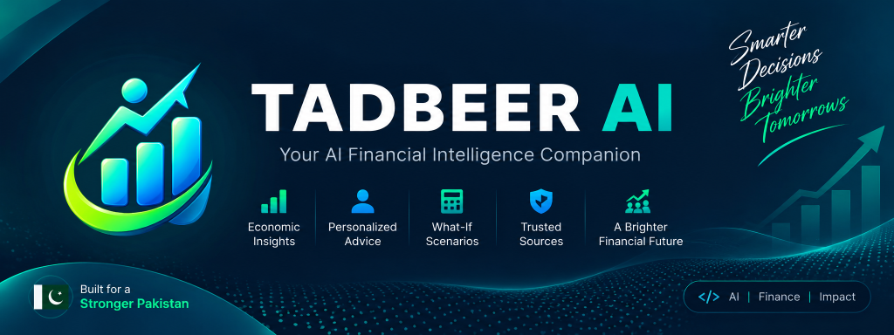

<p align="center">
  
</p>

<p align="center">
  <strong>Smarter Decisions, Brighter Tomorrows — Built for a Stronger Pakistan 🇵🇰</strong>
</p>

<p align="center">
  <a href="#-system-architecture"></a>
  <a href="#-flutter-mobile-application"></a>
  <a href="#-fastapi-backend"></a>
  <a href="#-firebase-authentication"></a>
  <a href="#-data-sources--provenance"></a>
  <a href="#-automated-test-suite--verification"></a>
  <a href="#-code-quality"></a>
</p>

---

## 📖 Table of Contents
- [About Tadbeer AI 2.0](#-about-tadbeer-ai-20)
- [Core Pillars & Capabilities](#-core-pillars--capabilities)
  - [1. Essential Prices & Economic Intelligence](#1-essential-prices--economic-intelligence-pbs-spi)
  - [2. Deterministic What-If Simulation Engine](#2-deterministic-what-if-simulation-engine)
  - [3. Personalized Financial Health & Profile Wizard](#3-personalized-financial-health--profile-wizard)
  - [4. Ask Tadbeer — Multi-Agent AI Companion](#4-ask-tadbeer--multi-agent-ai-companion)
  - [5. Firebase Authentication](#5-firebase-authentication)
  - [6. Trilingual Localization](#6-trilingual-localization)
- [System Architecture](#-system-architecture)
- [Repository Structure](#-repository-structure)
- [Getting Started](#-getting-started)
  - [Backend Setup (FastAPI + LangGraph)](#backend-setup-fastapi--langgraph)
  - [Mobile App Setup (Flutter)](#mobile-app-setup-flutter)
- [Automated Test Suite & Verification](#-automated-test-suite--verification)
- [Data Sources & Provenance Honesty](#-data-sources--provenance-honesty)
- [Hackathon Milestone](#-hackathon-milestone)

---

## 🌟 About Tadbeer AI 2.0

In Pakistan's dynamic macroeconomic climate—marked by shifting inflation, exchange rate adjustments, and volatile utility and food prices—everyday households, salaried professionals, and micro-entrepreneurs face four critical questions:

1. **"What is happening to the everyday commodities and essentials I actually buy?"**
2. **"How do these macroeconomic shifts impact my monthly household budget and runway?"**
3. **"What if petrol prices rise by 10%, or grocery expenses increase by Rs 5,000?"**
4. **"What concrete, prioritized financial actions should I take today to safeguard my family?"**

**Tadbeer AI 2.0** bridges this gap. It connects **official macroeconomic data and weekly essential commodity prices** with **user-specific financial contexts**, powering **100% deterministic What-If simulations** and a **supervised LangGraph multi-agent financial companion** fluent in English, Urdu (اردو), and Roman Urdu.

> 🛡️ **Guiding Principle: Zero Mathematical Hallucinations**  
> Large Language Models excel at synthesis, explanation, and empathetic communication, but are prone to calculation errors. In Tadbeer AI, **all arithmetic, scenario modeling, budget ratios, and runway projections are computed by deterministic Python and Dart mathematical engines**. The AI explains and contextualizes verified numbers without inventing data.

---

## 🚀 Core Pillars & Capabilities

### 1. Essential Prices & Economic Intelligence (PBS SPI)
- **Sensitive Price Indicator (SPI) Monitoring**: Tracks official weekly prices for 16 key consumer commodities across 17 urban centres and 50 markets in Pakistan (Flour, Tomatoes, Onions, Potatoes, Chicken, Fresh Milk, Eggs, Pulses, Cooking Oil, LPG Cylinders, etc.).
- **Economic Explanation**: Every commodity includes **What Changed**, **Why It Matters**, and a **Household Budget Impact** actionable hint.
- **Macroeconomic Dashboard**: Real-time tracking of Headline CPI Inflation, SBP Policy Rate, USD/PKR interbank rate, KIBOR (3-Month), FX Reserves, and Worker Remittances.
- **Transparent Provenance**: Direct citation of the Pakistan Bureau of Statistics (PBS) and State Bank of Pakistan (SBP), observation periods, and explicit status badges (`live` vs `demo`).

### 2. Deterministic What-If Simulation Engine
- **Mathematical Integrity**: Evaluates how economic shocks affect monthly income, discretionary spending, and emergency runway.
- **Multi-Shock Scenarios**:
  - *Income Shock*: Job loss, salary cuts, delayed bonuses.
  - *Essential Expense Shock*: Grocery hikes, kitchen commodity surges.
  - *Fuel & Transport Shock*: Petrol/diesel increases.
  - *Utility Tariff Shock*: Electricity/gas adjustments.
  - *Currency Depreciation Shock*: PKR devaluation against USD.
- **Actionable Guidance**: Every scenario output provides updated runway months, net cash flow balance, and prioritized financial steps.

### 3. Personalized Financial Health & Profile Wizard
- **4-Step Setup Wizard**: Smooth user onboarding covering Monthly Income, Savings, Budget Category Allocations, and Financial Goals.
- **50/30/20 Budgeting Rules**: Real-time classification of Needs, Wants, and Savings.
- **Financial Health Score (0–100)**: Transparent score evaluated on emergency fund sufficiency, debt load, budget compliance, and savings rate.
- **Local Device Privacy**: Financial transactions, budgets, goals, and profile data are stored 100% locally on-device via `SharedPreferences`.

### 4. Ask Tadbeer — Multi-Agent AI Companion
- **LangGraph Supervisor Graph**: A stateful multi-agent supervisor orchestrates user queries across specialized nodes:
  - `economic_intelligence`: Retrieves verified PBS SPI commodity prices and SBP indicators.
  - `what_if_analysis`: Runs deterministic scenario calculators.
  - `personal_finance`: Contextualizes user budget and spending patterns.
  - `general_financial_assistant`: Answers financial literacy, savings strategies, and halal finance questions.
- **Context-Aware Deep Linking**: Tap any essential commodity or economic indicator to ask Tadbeer directly about its impact.
- **Chat History Persistence**: Automatic local conversation persistence across app sessions with one-tap clear.

### 5. Firebase Authentication
- **Decoupled Repository Pattern**: Clean domain separation (`AuthRepository` &rarr; `FirebaseAuthRepository` / `MockAuthRepository`).
- **Secure Email/Password Flow**: Comprehensive error code mapping into friendly, actionable user messages.
- **Resilient Fallback**: Gracefully operates with offline mock authentication when Firebase is unconfigured or in test environments.

### 6. Trilingual Localization
- Complete native localization across all screens, charts, badges, and assistant interactions:
  - **English** (`en`)
  - **Urdu** (`ur`) — اردو میں مکمل مالیاتی رہنمائی
  - **Roman Urdu** (`ur-Latn`) — Aasan Roman Urdu for effortless accessibility.

---

## 🏗️ System Architecture

```mermaid
graph TB
    %% Mobile Layer
    subgraph Client ["Flutter Mobile Client (tadbeerai_app)"]
        UI["4-Tab Modern UI<br/>(Home | Finance | Economy | Ask Tadbeer)"]
        State["Riverpod State Management"]
        Router["GoRouter Deep Linking"]
        Storage["Local SharedPreferences<br/>(Financial Profile, Budgets, Chats)"]
        AuthRepo["AuthRepository<br/>(Firebase Auth + Mock Fallback)"]
    end

    %% Network Transport
    Client -->|REST & JSON (Dio)| Gateway

    %% Backend Layer
    subgraph Backend ["FastAPI AI Backend (tadbeerai_backend)"]
        Gateway["FastAPI API Gateway (/v1)"]
        
        subgraph DataAdapters ["Data Adapters & Gateways"]
            PBS["PBS SPI Commodity Client<br/>(16 Essential Items)"]
            SBP["SBP Macroeconomic Client<br/>(CPI, FX, KIBOR, USD/PKR)"]
            Cache["In-Memory TTL Cache"]
        end

        subgraph Engine ["Deterministic Calculation Engine"]
            WhatIfCalc["Scenario Calculators<br/>(Expense, Income, FX, Fuel)"]
            HealthCalc["Health Score & Runway Math"]
        end

        subgraph MultiAgent ["LangGraph Multi-Agent Pipeline"]
            Supervisor["Routing Supervisor"]
            NodeEcon["Economic Intelligence Node"]
            NodeWhatIf["What-If Analysis Node"]
            NodeFinance["Personal Finance Node"]
            NodeGeneral["General Assistant Node"]
        end
    end

    %% External Connections
    Gateway --> DataAdapters
    Gateway --> Engine
    Gateway --> MultiAgent
    DataAdapters --> Cache
    MultiAgent --> Supervisor
    Supervisor --> NodeEcon
    Supervisor --> NodeWhatIf
    Supervisor --> NodeFinance
    Supervisor --> NodeGeneral
    NodeWhatIf --> Engine
    NodeEcon --> DataAdapters
```

---

## 📂 Repository Structure

```
TadbeerAI 2.0/
├── assets/                          # Repository branding & media assets
│   └── banner.png                   # Official Tadbeer AI 2.0 Banner
├── tadbeerai_app/                   # Flutter Mobile Client
│   ├── lib/
│   │   ├── core/                    # App config, routing, themes, utils, widgets
│   │   ├── data/                    # Repositories (API, Mock, Firebase Auth)
│   │   ├── domain/                  # Entities (CommodityPrice, EconomicIndicator, Profile)
│   │   ├── features/
│   │   │   ├── assistant/           # Ask Tadbeer chat screen & bubble widgets
│   │   │   ├── auth/                # Login, Signup, AuthController
│   │   │   ├── dashboard/           # Home dashboard & economic pulse previews
│   │   │   ├── economy/             # Economy tab, Essential Prices, detail modal sheet
│   │   │   ├── finance/             # Financial health, budget breakdown, goals
│   │   │   └── profile/             # 4-step financial profile setup wizard
│   │   ├── l10n/                    # Localization catalogs (.arb files: en, ur, ur-Latn)
│   │   └── providers/               # Riverpod dependency injection & state providers
│   └── test/                        # 250 unit, repository, and widget tests
│
└── tadbeerai_backend/               # Python FastAPI + LangGraph Backend
    ├── core/
    │   ├── agents/                  # LangGraph multi-agent graph, supervisor & nodes
    │   ├── economic_data/           # PBS SPI commodity client, SBP client, service
    │   ├── llm/                     # Multi-provider LLM adapters (Gemini, Groq, Mock)
    │   ├── scenarios/               # Deterministic What-If mathematical calculators
    │   └── api_v1.py                # REST endpoints (/v1/chat, /v1/economy, etc.)
    └── tests/                       # 301 backend pytest test suites
```

---

## ⚡ Getting Started

### Prerequisites
- **Flutter SDK**: 3.22.0 or higher
- **Python**: 3.11 or higher
- **Git**

---

### Backend Setup (FastAPI + LangGraph)

1. **Navigate to the backend folder**:
   ```bash
   cd tadbeerai_backend
   ```

2. **Create and activate a virtual environment**:
   ```bash
   # Windows (PowerShell)
   python -m venv .venv
   .\.venv\Scripts\Activate.ps1

   # macOS / Linux
   python3 -m venv .venv
   source .venv/bin/activate
   ```

3. **Install dependencies**:
   ```bash
   pip install -r requirements.txt
   ```

4. **Configure environment variables**:
   Create a `.env` file in `tadbeerai_backend/`:
   ```env
   TADBEER_ENV=development
   TADBEER_LLM_PROVIDER=gemini       # Options: gemini | groq | mock
   GEMINI_API_KEY=your_gemini_key    # Optional if using mock provider
   GROQ_API_KEY=your_groq_key        # Optional fallback provider
   PORT=8000
   ```

5. **Run the backend server**:
   ```bash
   python main.py
   # Or using uvicorn directly:
   uvicorn main:app --host 0.0.0.0 --port 8000 --reload
   ```
   API Documentation is live at: `http://localhost:8000/docs`

6. **Run backend tests**:
   ```bash
   python -m pytest
   ```

---

### Mobile App Setup (Flutter)

1. **Navigate to the Flutter app directory**:
   ```bash
   cd tadbeerai_app
   ```

2. **Install Flutter packages**:
   ```bash
   flutter pub get
   ```

3. **Verify static analysis**:
   ```bash
   flutter analyze
   ```

4. **Run the Flutter test suite**:
   ```bash
   flutter test
   ```

5. **Launch the application**:
   ```bash
   # Running on connected device or emulator:
   flutter run
   ```

---

## 🧪 Automated Test Suite & Verification

The project enforces continuous verification across all domain, repository, widget, and agent logic.

| Scope | Suite | Result | Execution Time |
| :--- | :--- | :---: | :---: |
| **Flutter App** | `flutter test` | **250 Passed / 0 Failed** (5 skipped opt-in E2E) | ~20.2s |
| **Flutter Linter** | `flutter analyze` | **0 Errors / 0 Warnings / 0 Issues** | ~9.9s |
| **FastAPI Backend** | `pytest` | **301 Passed / 0 Failed** | ~1.12s |
| **Python Bytecode** | `compileall` | **Code 0 (Clean compilation)** | < 1.0s |
| **Combined** | **Total Verification** | **551 Automated Tests Passing** | — |

---

## 🏛️ Data Sources & Provenance Honesty

Tadbeer AI 2.0 upholds complete statistical integrity:

- **Pakistan Bureau of Statistics (PBS)**:
  - Weekly Sensitive Price Indicator (SPI) bulletin tracking 51 essential commodities across 17 urban centres and 50 markets.
  - Retail average prices for staple grains, pulses, dairy, poultry, vegetables, edible oil, and LPG cylinders.
- **State Bank of Pakistan (SBP)**:
  - Monetary Policy Committee policy rates, KIBOR (3-Month), weighted interbank USD/PKR exchange rates, and liquid FX reserves.
- **Status Transparency**:
  - Whenever live gateway connections are unavailable, the application gracefully switches to bundled seed data, explicitly badging status as `demo` or `partial` with detailed fallback reasons. **Synthetic numbers are never falsely marked as live**.

---

## 🏆 Hackathon Milestone

- **Competition**: Alibaba Cloud AI Hackathon Pakistan 2026
- **Current Milestone**: **Regional-Round Freeze Complete**
- **Theme**: Financial Intelligence, Inclusive FinTech, and Localized AI for Pakistan 🇵🇰

---

<p align="center">
  Built with ❤️ for a resilient, financially empowered Pakistan.<br/>
  <strong>Tadbeer AI 2.0 Team</strong>
</p>
